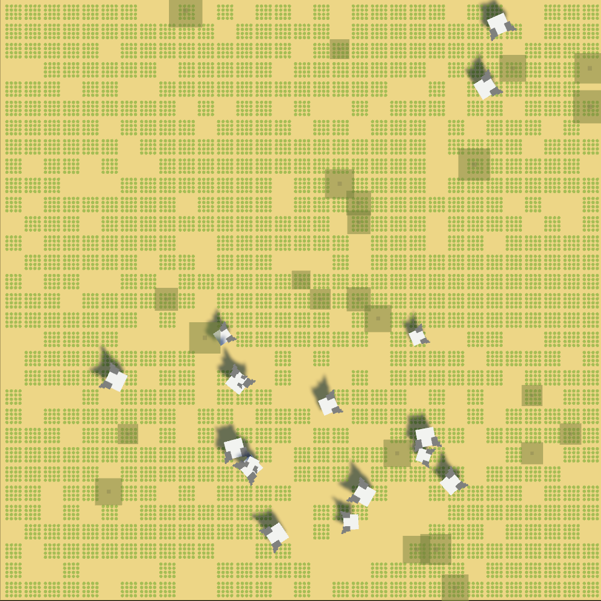
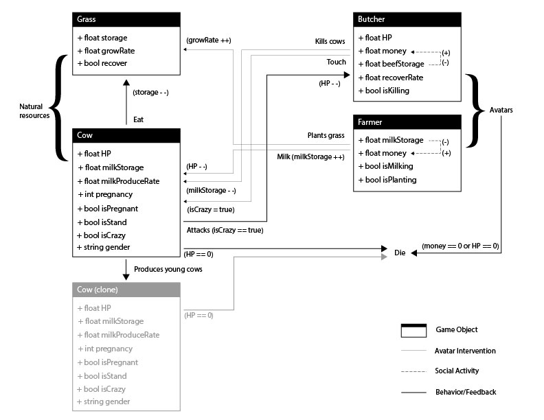

# SillySimulation 1 - Cowland

The environment has been extremely simplified and accelerated. 
The cow can propagate and eat grass very fast until it dies. 
Even if grass can recover (super slowly), the grassland will 
be destroyed by cows, which will die without grass (food) 
as the population increases. Players can choose an avatar in 
participant the game and may be able to change the simulation process. 

## The interactions and relationships between environment and cows&player

## installation
- download the project package: 
  - `wget -O cowland_package.unitypackage https://github.com/billbillbilly/SillySimulation/blob/main/cowland/package/cowland_package.unitypackage?raw=true`

## Game Demo
https://billbillbilly.itch.io/sillysimulation1cowland
